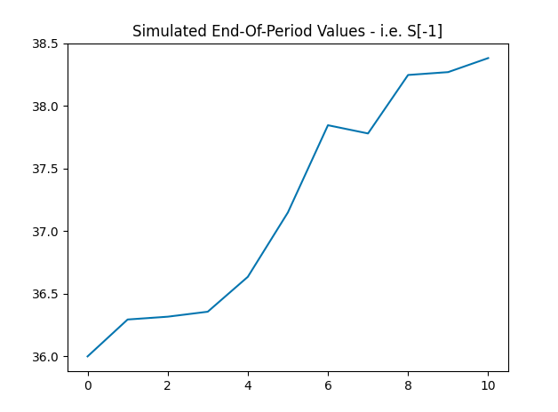

   

# Finance Projects    

**Monte Carlo Simulation - Black-Scholes-Merton Put Option (European Option)**        

  


**Continuous Compounding Interest Formula - Code in C++**    

> A = Pe<sup>r\*t</sup>    

Daily Compounding:    
> A = P(1 + r/365)<sup>365\*t</sup>  

Monthly Compounding:    
> A = P(1 + r/12)<sup>12\*t</sup>  

Quaterly Compounding:    
> A = P(1 + r/4)<sup>4\*t</sup>  

Yearly Compounding:  
> A = P(1 + r)<sup>t</sup>  

The `e` constant is defined as:  
> [e - Mathematical Constant](https://en.wikipedia.org/wiki/E_(mathematical_constant))  

To find **r** or **t** you have to use the natural logarithm -- `std::log()`.  

This program uses references and vectors instead of pointers and arrays --
initially it was done this way (using pointers and arrays), but I decided to change it to make it more
compatible with C++.  

Using arrays and pointers is allowed in C++, but it is more of
a C implementation.  

Variables:     
A = end amount    
P = principal amount    
e = Euler constant   
r = rate of growth   
t = time period    

```python
#compile with clang++ or g++
g++ compound_interest.cpp -o ci

#run 
./ci 
```  

**Compound Interest Formula- Code in C**   

Uses pointers and arrays.  

Will try to add a struct that contains all the variables needed for the
formula.  

```python 
#compile with clang or gcc
gcc compound_interest.c -lm 

#run 
./a.out
``` 

**Shorting the Market**  

Python script that shows what happens when short selling  

Two methods:  
- Price of the stock increases  
- Price of the stock decreases  

Results are a dataframe with the different price movements  

**Results image:**     
  
 
**Citation:**   
Python for Finance, Yves Hilpisch - [O'reilly Books]( https://learning.oreilly.com/library/view/python-for-finance/9781491945360/)  
Black-Scholes-Merton - [UCD](https://maths.ucd.ie/courses/mst3024/section4-3.pdf)  
Euler Methods - [MIT](https://web.mit.edu/10.001/Web/Course_Notes/Differential_Equations_Notes/node3.html)     
More Information on Growth Formula - [Continuous Growth and Decay](http://www.math.kent.edu/~mathweb/ebooks/10024/ch2_4.htm)  
Applied Finance Example - [Certificates of Deposit](http://www.terpconnect.umd.edu/~ykovache/Teaching/Math120S20/Lecture%205.2.pdf)  
The C Programming Language Dennis Ritchie and Brian Kernighan - Pointers and Arrays (Chapter 5) - [CS Princeton University](https://www.cs.princeton.edu/~bwk/cbook.html)  
Euler Constant Image - [CodeCogs](https://codecogs.com/latex/eqneditor.php)       
Short Example - [Investopedia - Minimum Margin Requirements](https://www.investopedia.com/ask/answers/05/shortmarginrequirements.asp)  
